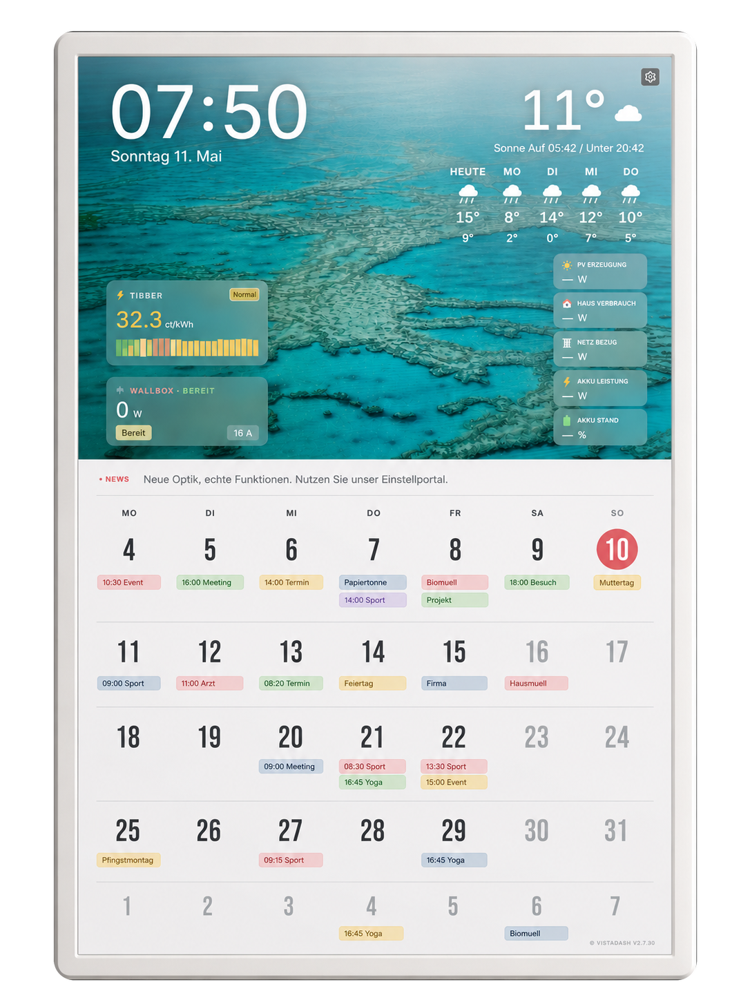

<p align="center">
  <a href="https://www.vista-board.com">
    
  </a>
</p>

<h1 align="center">VistaBoard</h1>

<p align="center">
  <strong>Turn any Raspberry Pi into a beautiful smart wall display.</strong><br>
  Calendar, weather, photos, solar energy, Tibber prices — one screen, zero hassle.
</p>

<p align="center">
  <a href="https://github.com/Masterzzz2/vistaboard-releases/releases/latest"></a>
  <a href="https://www.vista-board.com"></a>
  <a href="https://www.vista-board.com/installation"></a>
  
  
</p>

---

## What is VistaBoard?

VistaBoard is a turnkey smart display solution that transforms a Raspberry Pi (or any Linux mini-PC) into an always-on wall display. It shows your family calendar, weather, photos, news — and optionally solar PV data, battery status, wallbox charging and electricity prices.

**No coding. No config files. Just install and go.**

## Who is it for?

| Use Case | What you get |
|----------|-------------|
| **Families** | Shared calendar on the kitchen wall — everyone sees what's coming up |
| **Smart Home** | One dashboard for weather, energy, news — always visible, always on |
| **Solar / PV Owners** | Fronius inverter data, battery charge, grid import/export in real-time |
| **EV Owners** | Wallbox charging status, Tibber electricity prices at a glance |
| **Offices & Waiting Rooms** | Professional info display with news, weather and custom widgets |
| **Digital Photo Frame** | Rotating photos from Bing, Unsplash, iCloud or local folders |

## Features

### Display & Interface
- Portrait and landscape mode for wall-mounted displays
- Dark, pastel and fully customizable free-position layouts
- Auto display on/off scheduling (e.g. screen off at night)
- Automatic display rotation guard (survives monitor reconnect)
- Full browser-based settings — configure from any device

### Calendar & Information
- Apple iCloud, Google Calendar, CalDAV and any iCal URL
- Up to 6 calendars with individual colors
- Weather forecast with sunrise, sunset, alerts and detailed conditions
- RSS news ticker and custom information widgets
- Quotes of the day

### Energy & Smart Home
- Fronius PV inverter: real-time solar production, battery, grid
- Home battery charge status and power flow
- Wallbox / EV charging status
- Tibber dynamic electricity prices
- EPEX spot prices with custom surcharges
- Fixed or flexible electricity tariffs

### System
- Full i18n: German and English
- 30-day free trial — no credit card needed
- Automatic OTA updates with rollback safety
- Auto-reboot after updates, browser cache auto-clear
- Export/import settings between boards (license stays hardware-bound)

## Quick Install

Two commands — 5 minutes — done.

```bash
curl -fsSL https://www.vista-board.com/downloads/vistaboard-install.sh -o vistaboard-install.sh
sudo bash vistaboard-install.sh
```

Then open `http://<PI-IP>:3000` in any browser and follow the setup wizard.

**Full step-by-step guide:** [www.vista-board.com/installation](https://www.vista-board.com/installation)

## Hardware Requirements

| Component | Requirement |
|-----------|-------------|
| **Board** | Raspberry Pi 5 *(recommended)*, Pi 4, Pi 3 or Pi 2B |
| **RAM** | 2 GB minimum, 4 GB recommended |
| **Storage** | MicroSD 16 GB+ (32 GB recommended) |
| **Display** | Any HDMI monitor, TV or touchscreen |
| **Network** | WiFi or Ethernet |
| **OS** | Raspberry Pi OS (64-bit) Desktop |

Also works on Linux mini-PCs, old laptops, or any Debian-based system with a browser.

## Step-by-Step Installation

### 1. Prepare the SD Card

1. Download [Raspberry Pi Imager](https://www.raspberrypi.com/software/)
2. Select: **Raspberry Pi OS (64-bit) Desktop**
3. Click the gear icon — set WiFi, username, enable SSH
4. Write to SD card

### 2. Boot & Install

```bash
# SSH into your Pi (or open terminal on the Pi directly)
ssh pi@<PI-IP>

# Download and run installer
curl -fsSL https://www.vista-board.com/downloads/vistaboard-install.sh -o vistaboard-install.sh
sudo bash vistaboard-install.sh

# Reboot to start kiosk mode
sudo reboot
```

### 3. Configure

Open `http://<PI-IP>:3000` on any device and follow the wizard:
1. Language (DE / EN)
2. Activation (30-day free trial)
3. Calendar (paste your iCal URL)
4. Weather location
5. Done!

## Pricing

| Plan | Price | |
|------|-------|-|
| **Free Trial** | 30 days, all features | No credit card needed |
| **Monthly** | 2.99 EUR/month | Cancel anytime |
| **Yearly** | 29.49 EUR/year | Save 18% |

Activate directly in VistaBoard settings via PayPal. One license per device.

## Useful Commands

```bash
sudo systemctl status vistaboard    # Check status
sudo journalctl -u vistaboard -n 50 # View logs
sudo systemctl restart vistaboard   # Restart
hostname -I                          # Find Pi IP address
```

## Updates

VistaBoard updates automatically. You can also trigger updates manually in **Settings > Updates** or upload a `.tar.gz` package.

## Links

- **Website:** [www.vista-board.com](https://www.vista-board.com)
- **Installation Guide:** [www.vista-board.com/installation](https://www.vista-board.com/installation)
- **Releases:** [GitHub Releases](https://github.com/Masterzzz2/vistaboard-releases/releases)
- **Support:** support@vista-board.com

## Related Projects

- [Vista-PV](https://vista-pv.com) — Solar energy monitoring for Fronius inverters

---

<p align="center">
  Made with care in Germany
</p>

---

# Deutsch

<p align="center">
  <strong>Verwandle deinen Raspberry Pi in ein smartes Wanddisplay.</strong><br>
  Kalender, Wetter, Fotos, PV-Energie, Tibber-Strompreise — ein Bildschirm fuer alles.
</p>

## Was ist VistaBoard?

VistaBoard macht aus einem Raspberry Pi ein dauerhaft eingeschaltetes Wanddisplay fuer die ganze Familie. Es zeigt Kalender, Wetter, Fotos, Nachrichten — und optional PV-Daten, Hausakku, Wallbox und Strompreise.

**Kein Programmieren. Keine Konfigurationsdateien. Einfach installieren und fertig.**

## Fuer wen?

- **Familien** — Gemeinsamer Kalender an der Kuechenwand
- **Smart-Home-Nutzer** — Ein Dashboard fuer Wetter, Energie, Nachrichten
- **PV-/Solaranlagen-Besitzer** — Fronius-Daten, Batterie, Netzbezug live
- **E-Auto-Fahrer** — Wallbox-Status und Tibber-Strompreise auf einen Blick
- **Bueros & Wartezimmer** — Professionelles Info-Display
- **Digitaler Bilderrahmen** — Fotos von Bing, Unsplash, iCloud oder lokal

## Funktionen

- Apple iCloud, Google Calendar, CalDAV und beliebige iCal-URLs
- Wettervorhersage mit Sonnenaufgang, Wetterwarnungen und Details
- Fotos von Bing, Unsplash, iCloud oder lokalen Ordnern
- RSS-Nachrichten, Zitate und eigene Info-Widgets
- Fronius PV-Daten, Hausakku, Netzbezug/Einspeisung
- Tibber-Strompreise, EPEX Spot, feste oder flexible Tarife
- Wallbox-/Ladestatus
- Hoch- und Querformat, dunkles/Pastell-/freies Layout
- Deutsch und Englisch
- 30-Tage-Testphase, danach ab 2,99 EUR/Monat
- Automatische Updates mit Rollback-Sicherheit

## Schnellinstallation

```bash
curl -fsSL https://www.vista-board.com/downloads/vistaboard-install.sh -o vistaboard-install.sh
sudo bash vistaboard-install.sh
```

Dann `http://<PI-IP>:3000` im Browser oeffnen und dem Assistenten folgen.

**Ausfuehrliche Anleitung:** [www.vista-board.com/installation](https://www.vista-board.com/installation)

## Preise

| Tarif | Preis | |
|-------|-------|-|
| **Kostenlose Testphase** | 30 Tage, alle Funktionen | Keine Kreditkarte noetig |
| **Monatlich** | 2,99 EUR/Monat | Jederzeit kuendbar |
| **Jaehrlich** | 29,49 EUR/Jahr | 18% Ersparnis |

## Links

- **Homepage:** [www.vista-board.com](https://www.vista-board.com)
- **Installationsanleitung:** [www.vista-board.com/installation](https://www.vista-board.com/installation)
- **Releases:** [GitHub Releases](https://github.com/Masterzzz2/vistaboard-releases/releases)
- **Support:** support@vista-board.com
