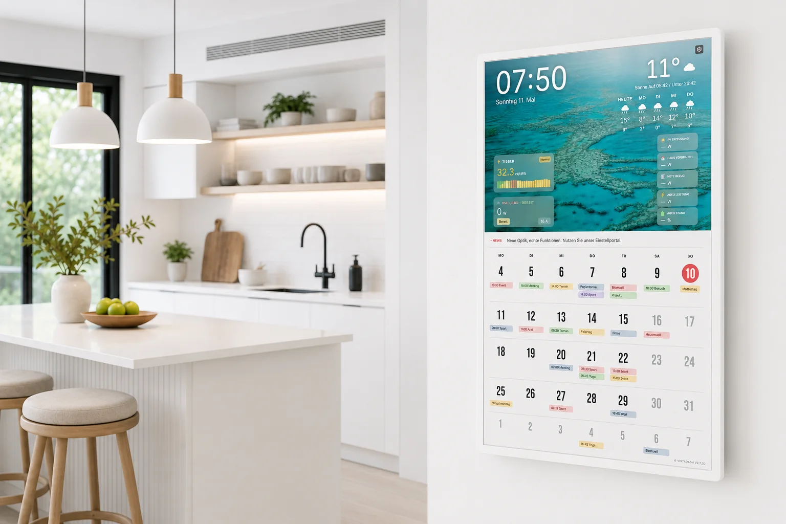

<p align="center">
  <a href="https://www.vista-board.com">
    
  </a>
</p>

<h1 align="center">Vista-Board</h1>

<p align="center">
  <strong>Raspberry Pi calendar display and smart wall dashboard for families, smart homes and solar households.</strong><br>
  Apple iCloud, Google Calendar, weather, photos, PV energy, Tesla battery state, wallbox status and Tibber prices — on one always-visible screen.
</p>

<p align="center">
  <a href="https://github.com/Masterzzz2/vistaboard-releases/releases/latest"></a>
  <a href="https://www.vista-board.com/raspberry-pi-calendar-display/"></a>
  <a href="https://www.vista-board.com/installation"></a>
  <a href="https://www.vista-board.com/tester/en/"></a>
  
</p>

<p align="center">
  <a href="https://www.vista-board.com/installation"><strong>Installation guide</strong></a> ·
  <a href="https://github.com/Masterzzz2/vistaboard-releases/releases/latest"><strong>Latest release</strong></a> ·
  <a href="https://www.vista-board.com/raspberry-pi-calendar-display/"><strong>Raspberry Pi calendar display</strong></a> ·
  <a href="https://www.vista-board.com/tester/en/"><strong>Become a tester</strong></a>
</p>

---

## What is Vista-Board?

Vista-Board turns a Raspberry Pi or Linux mini PC into a permanent wall display for your home, office or solar setup. It is made for people who want a useful dashboard on the wall without building a custom MagicMirror or maintaining config files.

Typical use cases:

- a **family calendar display** in the kitchen or hallway,
- a **Raspberry Pi wall calendar** for Apple iCloud and Google Calendar,
- a **smart home dashboard** with weather, photos, news and reminders,
- a **PV / solar dashboard** for Fronius, home battery, Tesla battery state, wallbox and Tibber electricity prices,
- a small **office, waiting-room or lobby information display**.

**No coding. No YAML. No cloud display account required for the dashboard itself.**

## Download: choose the right start

| If you want... | Use this | Link |
| --- | --- | --- |
| The easiest first setup | Ready-made Raspberry Pi SD card image | [SD image release](https://github.com/Masterzzz2/vistaboard-releases/releases/tag/sd-image) or [installation page](https://www.vista-board.com/installation) |
| Existing Raspberry Pi OS / Debian / Ubuntu | Installer script | [Installation guide](https://www.vista-board.com/installation) |
| To understand the product first | Website and screenshots | [vista-board.com](https://www.vista-board.com) |
| Help testing and feedback | Tester flow | [Become a tester](https://www.vista-board.com/tester/en/) |

### Which image should I download?

- **Raspberry Pi 3 / 4 / 5:** use `VistaBoard-RaspberryPi-64bit.img.xz` from the [SD image release](https://github.com/Masterzzz2/vistaboard-releases/releases/tag/sd-image).
- **Raspberry Pi 2B:** use `VistaBoard-RaspberryPi-Pi2B-32bit.img.xz` from the [SD image release](https://github.com/Masterzzz2/vistaboard-releases/releases/tag/sd-image).
- **Mini PC / existing Linux:** use the installer script instead of an SD card image.

If you are unsure, start with the installation page: <https://www.vista-board.com/installation>

## Why people use it

| Problem | Vista-Board solves it by showing... |
| --- | --- |
| Family appointments are hidden on phones | shared Apple iCloud, Google, Outlook, Nextcloud and iCal calendars |
| A paper calendar is always outdated | live calendar changes on a large wall display |
| Smart-home information is split across apps | weather, photos, news, reminders and widgets in one place |
| Solar, Tesla and energy data are hidden in vendor apps | Fronius PV, home battery, grid import/export, Tesla battery state, wallbox and Tibber prices |
| MagicMirror is too technical for everyday use | a guided wall display product instead of a module/config project |

## Easiest setup: ready-made Raspberry Pi image

For beginners, the recommended installation is the ready-made Vista-Board Raspberry Pi image. You do not need to install Linux manually and you do not need terminal commands for the first start.

1. Download the SD card image from the [SD image release](https://github.com/Masterzzz2/vistaboard-releases/releases/tag/sd-image) or start from [vista-board.com/installation](https://www.vista-board.com/installation).
2. Install [Raspberry Pi Imager](https://www.raspberrypi.com/software/) on Windows, macOS or Linux.
3. In Raspberry Pi Imager choose your Pi model, then **Choose OS > Use custom image**.
4. Select the downloaded `.img.xz` file. Do not unzip it.
5. Choose your microSD card, enter Wi-Fi in the advanced settings if needed, and write the card.
6. Insert the card into the Raspberry Pi, connect HDMI and power. The first boot can take a few minutes.
7. Open `http://<PI-IP>:3000` from a phone, tablet or computer in the same network and follow the setup wizard.

Printable beginner PDF in German and English: [Vista-Board image guide](https://www.vista-board.com/downloads/vistaboard-image-anleitung.pdf)

### Quick decision: image or installer?

| Option | Best for | What you do |
|--------|----------|-------------|
| **Ready-made image** | Beginners and new Raspberry Pi setups | Flash one `.img.xz` file to the SD card |
| **Installer script** | Existing Raspberry Pi OS / Debian / Ubuntu systems | Run the install command in a terminal |

## Features

### Calendar and everyday information

- Apple iCloud, Google Calendar, Outlook, Nextcloud, CalDAV and any iCal/ICS URL
- Multiple calendars with individual colors
- Weather forecast with sunrise, sunset, alerts and detailed conditions
- Photos from Bing, Unsplash, iCloud/shared folders or local folders
- RSS/news ticker, quotes, reminders, countdowns and custom widgets

### Energy and smart home

- Fronius PV inverter: real-time solar production, battery, grid import/export
- Home battery charge status and power flow
- Wallbox / EV charging status
- Tesla battery state, estimated range and charging status when connected
- Tibber dynamic electricity prices
- EPEX spot prices with custom surcharges
- Fixed or flexible electricity tariffs

### Display and system

- Portrait and landscape mode for wall-mounted monitors
- Dark, pastel and free-position layouts
- Browser-based settings from phone, tablet or computer
- German and English interface
- Automatic OTA updates with rollback safety
- 30-day trial, then monthly or annual licence

## Quick install on existing Raspberry Pi OS / Debian / Ubuntu

```bash
curl -fsSL https://www.vista-board.com/downloads/vistaboard-install.sh -o vistaboard-install.sh
sudo bash vistaboard-install.sh
```

Then open `http://<PI-IP>:3000` in any browser and follow the setup wizard.

Full guide: <https://www.vista-board.com/installation>

## Hardware requirements

| Component | Requirement |
|-----------|-------------|
| **Board** | Raspberry Pi 5 recommended; Pi 4, Pi 3 and Pi 2B supported depending on image/install path |
| **RAM** | 2 GB minimum, 4 GB recommended |
| **Storage** | microSD 16 GB+; 32 GB or SSD recommended |
| **Display** | HDMI monitor, TV or touchscreen; 24–27 inch portrait display works well |
| **Network** | Wi-Fi or Ethernet |
| **OS** | Raspberry Pi OS, Debian or Ubuntu for installer-based setup |

Also works on Linux mini PCs, old laptops or other Debian-based systems with a browser.

## Pricing

| Plan | Price | Notes |
|------|-------|-------|
| **Trial** | 30 days | All features, no payment details for the trial |
| **Monthly** | 2.99 EUR/month | Cancel anytime |
| **Yearly** | 29.49 EUR/year | Lower yearly cost |

Activate directly in Vista-Board settings via PayPal. One licence per device.

## FAQ

### Is Vista-Board open source?

This repository is used for public releases, downloads and installation assets. The product itself is distributed as Vista-Board software with a 30-day trial and paid licence after the trial.

### Does the dashboard require a cloud account?

No proprietary Vista-Board cloud account is required for the local dashboard display. The software runs on your Raspberry Pi or Linux mini PC. External services such as Google Calendar, iCloud, weather data, Fronius or Tibber are only used when you configure those features.

### Can I use it as a DAKboard or MagicMirror alternative?

Yes. Vista-Board is especially useful if you want a guided Raspberry Pi wall display for calendars, photos, weather and energy data without maintaining a custom dashboard project.

### Can Vista-Board show Tesla data?

Yes. Vista-Board can show Tesla battery state, estimated range and charging status when Tesla is connected in the settings. This is useful together with PV, wallbox and electricity prices because the car becomes part of the visible home-energy overview.

### Where do I get support?

Use the website support page or email support@vista-board.com. If you are testing the software, the tester page explains what feedback is most helpful.

## Useful commands

```bash
sudo systemctl status vistaboard    # Check service status
sudo journalctl -u vistaboard -n 50 # View logs
sudo systemctl restart vistaboard   # Restart service
hostname -I                         # Find Pi IP address
```

## Links

- Website: <https://www.vista-board.com>
- Raspberry Pi calendar display: <https://www.vista-board.com/raspberry-pi-calendar-display/>
- Installation guide: <https://www.vista-board.com/installation>
- Latest release: <https://github.com/Masterzzz2/vistaboard-releases/releases/latest>
- Tester page: <https://www.vista-board.com/tester/en/>
- DAKboard alternative: <https://www.vista-board.com/dakboard-alternative/en/>
- Tesla battery state on a wall display: <https://www.vista-board.com/blog/tesla-ladestand-auf-wanddisplay-anzeigen/en/>
- Support: support@vista-board.com

---

# Deutsch

<p align="center">
  <strong>Raspberry-Pi-Kalender und smartes Wanddisplay fuer Familie, Smart Home und PV-Haushalte.</strong><br>
  Apple iCloud, Google Kalender, Wetter, Fotos, PV-Energie, Tesla-Ladestand, Wallbox und Tibber-Strompreise — ein Bildschirm fuer alles.
</p>

<p align="center">
  <a href="https://www.vista-board.com/installation"><strong>Installationsanleitung</strong></a> ·
  <a href="https://github.com/Masterzzz2/vistaboard-releases/releases/latest"><strong>Aktuelles Release</strong></a> ·
  <a href="https://www.vista-board.com/tester/"><strong>Tester werden</strong></a>
</p>

## Was ist Vista-Board?

Vista-Board macht aus einem Raspberry Pi oder Linux-Mini-PC ein dauerhaft sichtbares Wanddisplay. Es zeigt Familienkalender, Wetter, Fotos, Nachrichten und optional PV-Daten, Hausakku, Tesla-Ladestand, Wallbox und Strompreise.

Typische Einsaetze:

- **digitaler Familienkalender** in Kueche oder Flur,
- **Raspberry-Pi-Wandkalender** fuer Apple iCloud und Google Kalender,
- **Smart-Home-Dashboard** mit Wetter, Fotos, Nachrichten und Erinnerungen,
- **PV-/Solar-Dashboard** fuer Fronius, Hausakku, Tesla-Ladestand, Wallbox und Tibber,
- **Info-Display** fuer Buero, Wartezimmer, Lobby oder Ferienwohnung.

**Kein Programmieren. Keine YAML-Dateien. Kein Cloud-Display-Konto fuer die Anzeige selbst.**

## Download: welcher Weg ist richtig?

| Wenn du ... | Nimm diesen Weg | Link |
| --- | --- | --- |
| moeglichst einfach starten willst | fertiges Raspberry-Pi-SD-Karten-Image | [SD-Image-Release](https://github.com/Masterzzz2/vistaboard-releases/releases/tag/sd-image) oder [Installationsseite](https://www.vista-board.com/installation) |
| schon Raspberry Pi OS / Debian / Ubuntu installiert hast | Installationsskript | [Installationsanleitung](https://www.vista-board.com/installation) |
| erst verstehen willst, was Vista-Board macht | Webseite und Screenshots | [vista-board.com](https://www.vista-board.com) |
| Feedback geben und testen willst | Tester-Seite | [Tester werden](https://www.vista-board.com/tester/) |

### Welche Datei brauche ich?

- **Raspberry Pi 3 / 4 / 5:** `VistaBoard-RaspberryPi-64bit.img.xz` aus dem [SD-Image-Release](https://github.com/Masterzzz2/vistaboard-releases/releases/tag/sd-image) verwenden.
- **Raspberry Pi 2B:** `VistaBoard-RaspberryPi-Pi2B-32bit.img.xz` aus dem [SD-Image-Release](https://github.com/Masterzzz2/vistaboard-releases/releases/tag/sd-image) verwenden.
- **Mini-PC / vorhandenes Linux:** Installationsskript statt SD-Karten-Image verwenden.

Wenn du unsicher bist, starte hier: <https://www.vista-board.com/installation>

## Funktionen

- Apple iCloud, Google Kalender, Outlook, Nextcloud, CalDAV und beliebige iCal/ICS-URLs
- mehrere Kalender mit eigenen Farben
- Wettervorhersage, Sonnenaufgang, Sonnenuntergang und Wetterdetails
- Fotos von Bing, Unsplash, iCloud/geteilten Ordnern oder lokalen Ordnern
- RSS/Nachrichten, Zitate, Erinnerungen, Countdowns und eigene Widgets
- Fronius-PV-Daten, Hausakku, Netzbezug/Einspeisung
- Wallbox-/Ladestatus
- Tesla-Ladestand, Reichweite und Ladezustand bei eingerichteter Tesla-Verbindung
- Tibber-Strompreise, EPEX Spot, feste oder flexible Tarife
- Hoch- und Querformat, dunkles/Pastell-/freies Layout
- Deutsch und Englisch
- automatische Updates mit Rollback-Sicherheit
- 30-Tage-Testphase, danach Monats- oder Jahreslizenz

## Schnellinstallation auf vorhandenem Raspberry Pi OS / Debian / Ubuntu

```bash
curl -fsSL https://www.vista-board.com/downloads/vistaboard-install.sh -o vistaboard-install.sh
sudo bash vistaboard-install.sh
```

Danach `http://<PI-IP>:3000` im Browser oeffnen und dem Assistenten folgen.

Ausfuehrliche Anleitung: <https://www.vista-board.com/installation>

## Preise

| Plan | Preis | Hinweis |
|------|-------|---------|
| **Testphase** | 30 Tage | alle Funktionen, ohne Zahlungsdaten fuer den Test |
| **Monatlich** | 2,99 EUR/Monat | jederzeit kuendbar |
| **Jaehrlich** | 29,49 EUR/Jahr | guenstiger als monatlich |

Aktivierung direkt in Vista-Board per PayPal. Eine Lizenz pro Geraet.

## Haeufige Fragen

### Kann Vista-Board Tesla-Daten anzeigen?

Ja. Vista-Board kann bei eingerichteter Tesla-Verbindung Ladestand, Reichweite und Ladezustand anzeigen. Besonders sinnvoll ist das zusammen mit PV, Wallbox und Strompreisen, weil das Auto dann Teil der sichtbaren Energieuebersicht im Haus wird.

## Links

- Webseite: <https://www.vista-board.com>
- Installation: <https://www.vista-board.com/installation>
- Aktuelles Release: <https://github.com/Masterzzz2/vistaboard-releases/releases/latest>
- Tester-Seite: <https://www.vista-board.com/tester/>
- DAKboard-Alternative: <https://www.vista-board.com/dakboard-alternative/>
- Tesla-Ladestand auf dem Wanddisplay: <https://www.vista-board.com/blog/tesla-ladestand-auf-wanddisplay-anzeigen/>
- Support: support@vista-board.com

---

<p align="center">
  Made with care in Germany
</p>
